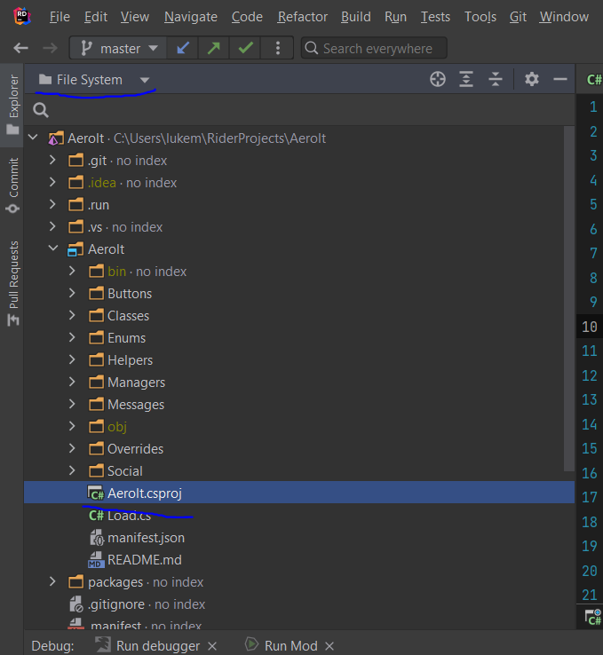

# Debugging Your Mods

The microsoft documentation says:

When you debug your app, it usually means that you are running your application with the debugger attached. When you do this, the debugger provides many ways to see what your code is doing while it runs. You can step through your code and look at the values stored in variables, you can set watches on variables to see when values change, you can examine the execution path of your code, see whether a branch of code is running, and so on. If this is the first time that you've tried to debug code, you might want to read [Debugging for absolute beginners](https://docs.microsoft.com/en-us/visualstudio/debugger/debugging-absolute-beginners?view=vs-2022) before going through this guide.

## General Setup
1. [Install BepInEx from thunderstore](https://thunderstore.io/package/bbepis/BepInExPack/)
2. [Install doorstop 4](https://cdn.discordapp.com/attachments/567836513078083584/1068586988673961984/BepInEx_x64_5.4.19.0_Doorstop_4.zip)
3. Drag and drop as follow into your Risk of Rain 2 game folder
	* If  you want to debug an R2ModMan profile instead, drag and drop the contents of the Zip file into your r2modman profile


It should replace a lot of files, press yes to all

4. Open the `doorstop_config.ini`
You can set the config like this
```
# If true, Mono debugger server will be enabled
debug_enabled=true

# When debug_enabled is true, this option specifies whether Doorstop should initialize the debugger server
# If you experience crashes when starting the debugger on debug UnityPlayer builds, try setting this to false
debug_start_server=true

# When debug_enabled is true, specifies the address to use for the debugger server
debug_address=127.0.0.1:55555

# If true and debug_enabled is true, Mono debugger server will suspend the game execution until a debugger is attached
debug_suspend=true
```
This will make doorstop suspend the game on start, open a debugging server at port 55555, allowing you to attach any debugger of your liking, you can use either VS, dnSpy or Rider.

5. Don't forget to put the .pdb file next to your plugin .dll, that's the file which contains the debug data

Putting breakpoints inside game assemblies while using the Visual Studio Debugger is not possible currently, but works with dnSpy, please refer to the dnSpy section below on how to configure it.

*__Notice:__* using the custom Doorstop version can cause issues with the BepInEx GUI that's bundled in RoR2BepInExPack, it is recommended to go into BepInEx's config (``BepInEx\config\BepInEx.cfg``) and set the ``Logging.Console``'s ``Enabled`` config to ``true``, and setting BepInExGUI's config (``BepInEx\config\BepInEx.GUI.cfg``)'s ``Enable BepInEx GUI`` config to ``false``

## Visual Studio 2022
- Install [Visual Studio Tools for Unity](https://docs.microsoft.com/en-us/visualstudio/gamedev/unity/get-started/getting-started-with-visual-studio-tools-for-unity?pivots=windows)
- Install [UnityModExtension](https://cdn.discordapp.com/attachments/562704639569428506/950162181285085194/UnityModExtension.vsix)
- Configure the Unity Mod Extension if needed by going in Tools -> Options

  

- Press Debug -> Run Game and Start Debugging

  

## dnSpy

Make sure the `doorstop_config.ini` is setup like above, but with the `debug_suspend=false`, since having it as `true` doesn't seem to work with dnSpy

You'll need to setup the BepInEx.cfg so that it dumps game assemblies to folder, as there may be BepInEx patchers modifying the game assemblies.

In the `BepInEx/config/BepInEx.cfg`, set to true the following entries: `DumpAssemblies`, `LoadDumpedAssemblies` and `BreakBeforeLoadAssemblies`.

In dnSpy, make sure that the RoR2.dll that is in there is the assembly from `BepInEx\DumpedAssemblies\Risk of Rain 2\RoR2.dll`

Then, launch the game, attach with dnSpy through `Debug -> Start Debugging -> Debug Engine: Unity (connect)`

It should automatically breakpoint somewhere inside a BepInEx assembly, then you'll be able to put any breakpoint in the game assemblies

## Rider

**REQUIRED**:
Your profile MUST have...

Debugging with Rider requires slightly more setup, but will be fully functional using Rider's built-in debugger tool. Additionally, you will have a highly-configurable build-run-debug pipeline. The process is straightforward:
- Build
- Run
- Connect

### Building with Rider
As you know, by default, Rider outputs the build to project_root/bin/Debug directory. However, we will improve this to automatically our mod to our plugin directory.
1. Get absolute path of your desired output location (see below)
   1. For r2modman profiles (recommended), it should look something like ```C:\Users\YOUR_USER_NAME\AppData\Roaming\r2modmanPlus-local\RiskOfRain2\profiles\YOUR_PROFILE_NAME\BepInEx\plugins\YOUR_PLUGIN_NAME```
   2. If you are NOT using r2modman, your path should look something like this: ```C:\Program Files (x86)\Steam\steamapps\common\Risk of Rain 2\BepInEx\plugins```
2. Open your ```PROJECT.csproj``` (If you can't find it, make sure you select "File System", as I've underlined in the blue at the top):

3. Add the following to the csproj file
```cs
    <PropertyGroup Condition=" '$(Configuration)' == 'Debug' ">
      <OutputPath>bin\Debug\</OutputPath>
      <ProfilePluginPath>THE_PATH_YOU_COPIED_IN_STEP_1\</ProfilePluginPath> <!-- (Make sure you have a trailing slash!) -->
    </PropertyGroup>
        
    <Target Name="PostBuildScript" AfterTargets="Build" Condition="'$(Configuration)' == 'Debug'">
        <ItemGroup>
            <_CopyItems Include="$(TargetDir)*.*" />
        </ItemGroup>
        <Message Text="Copying files $(TargetDir) to $(ProfilePluginPath)" />
        <Copy SourceFiles="@(_CopyItems)" DestinationFolder="$(ProfilePluginPath)" /> 
    </Target>
</Project> <-- (Make sure you paste within the Project tag like i'm showing here. Don't include this line)
```
We're all done with building! Feel free to give it a test by building your project and ensuring the build ends up in the right location.

### Running with Rider
We're going to piggyback on Rider's build in "Run and Debug" modes. 

